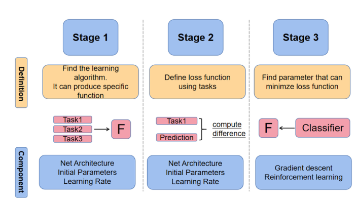

# Few-Shot and Continual Learning for Fake Image detection - paper
## Notes
In the FSL survey, could be useful to check papers [6], [7], [8]. They explain the taxonomy for FSL under different problem perspectives.

## Few-Shot Learning - FSL(Emanuele)
**FSL is meant to address the scarcity of the datasets volume, a problem present in many real applications**

The objective is to achieve a **class of methods that generalize well on those problems**
    
*"...It is difficult to generalize the same model across different data distributions when there is rarely any data."*

### 1. What is FSL?
Theoretical challenges in FSL center around issues like **domain adaptation** and **PAC learning(probably approximately correct)**, where models often have inaccurate mean and variance estimates due to small sample sizes. 

- **FSL models are evaluated as **N-way-K-shot** tasks, indicating the number of classes (N) and examples per class (K).**
  So 5-way-1-shot tasks are tasks where we have 1 example for each class available (so 5 in total), and an input has to be classify on onw of the 5 classes

- **More data generally improves model performance, but with diminishing returns as sample sizes grow.**

FSL faces several challenges:

- **Inaccurate Data Distribution Assessment:** Limited data makes it hard to estimate true data distributions, leading to biases.
- **Feature Reuse Sensitivity:** Transfer learning can bring prior feature knowledge, but it may not generalize well to new FSL tasks, especially in cross-domain scenarios.
- **Generality of Future Tasks:** Meta-learning enables fast adaptation to new tasks but struggles if training and testing tasks aren’t sufficiently similar.
- **Effectiveness of Multimodal Information Fusion:** FSL aims to integrate diverse data types (e.g., image and text) but faces difficulty embedding these into a common space with minimal loss.

These challenges highlight the need for better data distribution, feature adaptation, task generality, and multimodal integration to advance FSL.

### 2. How does FSL relate to traditional ML?
#### Definition ML
*"...In 2020, Wang et al. [6] give a standard definition through experience (E), task (T ), and performance (P) of machine learning: A computer program is said to learn from experience E with respect to some classes of task T and performance measure P if its performance can improve with E on T measured by P. It is worth mentioning that E in FSL is very scarce."*

**...its performance can improve with E on T measured by P. It is worth mentioning that E in FSL is very scarce.**

#### Key Points
But in humans it has been seen that regardless of the experience, they are able to generalize sufficiently well.
- Domain Adaptation: Is the concept of shifting an ML or DL task from the source domain to the target domain
- PAC: *Probably Approximately Correct* and then PACC *Probably Approximately Correct Constrained* are about finding the relationship between the true error rate and the number of training samples. To give an estimation of how many samples do I need to generalize well on a certain domain 

Those two concepts, **Domain Adptation** and **PAC theory**, applied toghether: *"... guarantees about a model's performance on the target domain."* (GPT)

### 3. How does FSL relate to Transfer Learning (TL)?
#### Definition TL
*"Transfer Learning is a machine learning technique where a model trained on one task is re-purposed and fine-tuned for a related, but different task."* (papers with code)

#### Key Points
*"Contrasted to transfer learning, the limited amount of training data, domain variations, and task modifications make FSL more challenging."*

*"... **one-shot learning (OSL)**, **zero-shot learning (ZSL)**, and **cross-domain few-shot learning**. These variants are considered special cases of transfer learning in terms of sample size and domain learning."*

The distinction is based on the number of sample present in the support set. Which tipically are many, but in FSL settings are:

- **One-Shot Learning (OSL)**: OSL has one available sample per class in the support dataset. The model only needs to answer yes or no based on the support set. In fact, one- shot learning does not classify the data specifically, but simply makes a cluster to learn the similarity metric function.
- **Zero-Shot Learning (ZSL)**: ZSL doesn't have any sample, it doesn't have any support dataset. The absence of any support samples, zero-shot learning completely relies on semantic features as a bridge to inference the unseen samples.

### 4. How does FSL relate to Meta Learning?
#### What is Episodic Training?
Episodic Training is a Training procedure under the FSL domain, which consist to train a model not by giving all the training samples in a single shot(classical approach) but to divide them into "episodes".
Each episode is a random sampling of data for each class assigned to the new "Support set" which is then validated on the "Query set" which is just a standard set of unseen samples(validation set).

The tipical procedure for training is:

**Episode Begins**
1. Sampling the *Support Set*
2. Train and adapt on the *Support Set*
3. Validate the results on the *Query Set*

**Episode Ends**

4. Optimize the model based on its performance across the episodes.
#### What is Meta-Learning?
Fig. 3 - Illustration of the Meta Learning approach

Meta-learning is tipically referred as "learning to learn" ML model. Is the set of learning algorithms that learn to adapt to different(but similar) tasks. 
*"Instead of training a model to perform a single task, meta-learning aims to equip the model with the ability to generalize across a variety of tasks, enabling quick learning from minimal data."* (GPT)

Three phases of meta-learning:
1. **Finding the Learning Algorithm:** Choose a meta-learning framework(the architecture for the meta-learning e.g., MAML) that defines how the model will learn from multiple tasks.
2. **Defining the Loss Function Using Tasks:** Create a loss function that evaluates how well the model adapts to each task, ensuring it learns generalizable patterns.
3. **Finding Parameters That Can Minimize the Loss Function:** Optimize the model's parameters so that the loss across all tasks is minimized, enabling quick adaptation to new, unseen tasks. 

*Example*:
- In the "Metric Based Meta Learning" **(See table 9)** the **Convolutional Siamese neural network** is an example of simple Meta-learning, with only 1 base learner and 1 meta learner
  - There are 2 identical network with parameters and weight shared
  - Both networks are joined by a loss function that calculates a distance metric (usually pairwise similarity)
- In the "Optimization Based Meta Learning" the **Model-agnostic meta learning (MAML)** is called "agnostic" cause: *"...makes it compatible with any model trained using gradient descent and suitable for solving various learning problems, such as classification, regression and reinforcement learning."*
  - The core idea behind MAML is to train the model’s initial parameters in a way that a few gradient updates will result in rapid learning on a new task.
  - It is "architecture dependent" and needs a lot of work to find the right parameters and architecture.
  
#### Key Points

*"It focuses on improving generalization for unseen tasks with the assistance of prior knowledge. If the prior knowledge is used to assist the model in learning on a specific task, then meta-learning can be regarded as a variant of FSL."*

But: ***"... Meta-learning is not equivalent to FSL."***

**IMPORTANT:** *"Nevertheless, meta-learning has its own limitations: when the training and testing tasks exist obvious domain gap, meta-learning rarely initializes parameter weights. In addition, meta-learning is highly dependent on the structure of the network and needs to be redesigned for widely varying tasks"*

Finally: *"... meta-learning is still one of the most effective methods to address FSL issues."*

So, FSL and meta-learning have the same or similar objective, to improve a model generalization capability on a broad number of tasks. FSL can be considered a particular case of meta-learning, in applications where the gap between the tasks domains is considerable and there are no considerable amount of training samples.
### The survey 
The survey analized, classify FSL approaches based on the level of abstraction(and the quality) of prior knowledge available.

*"In our survey, from the level of abstraction of prior knowledge, we represent the work of FSL as data level, feature level, task level, and multimodal level."*

1. **Data level:** 
    *"...which mainly aims to increase the data diversity as much as possible by transforming metric functions or directly generating new data"*

    They divide **Data Augmentation** in two sub categories:
    - **Data Expansion:** Could be: (1) applying transformation rules directly on the training set, (2)learning transformation rules from other semi-supervised datasets (3)or selecting suitable samples from similar semi-supervised datasets.
    - **Feature Expansion:** is mainly performed with (1) the assistance of *unlabelled query sets* and *semi-supervised reference datasets*, with (2) *discriminative feature representation* on the feature space.
  
  ***"...the use of auxiliary datasets is more effective than the absence of auxiliary datasets, and feature augmentation is commonly more effective than data expansion."***

2. **Feature level:**
    *"...which can be used as the basic statistical knowledge of a domain between the data and the corresponding labels."*
    There are two stage when doing **Transfer Learning:**
    1. **Pre-Training:** made in an Supervised or Unsupervised manner; is training an existing model to extract features on *"large base class dataset that covers similar downstream tasks"* 
    2. **Fine-Tuning:** high level semantic features are closely related to the target task after step 1, now we reuse those feature knowledge for downstream tasks *"....Baseline [92] uses a standard feature extractor followed by a fully connected layer. Baseline++ [92] (1)**replaces the fully connected layer with a cosine metric function.** When the computing power is sufficient, (2)**evolution strategies [93] are good choices to determine the number of retrain layers and learning rates.** In addition, (3)**experiences convince that just re-randomizing the top-level parameters** [94] and (4)**self-distillation of the same architecture knowledge [95] are also beneficial to FSL.**"*
    3. **Prompt-Learning:** as an alternative to *Fine-Tuning*, *"is not necessary to design a loss function but requires a slight manual prompting to the pre-trained model."*
      - **Prefix Prompt:** prefix prompt indicates that subsequent text is combined with prefix words corresponding to different tasks
      - **Cloze-style Prompt:** Cloze-Style prompt means to fill suitable words in the blanks of sentences 
    ***...Among them, prompt learning retains the better capability of the pre-trained model for each task than fine-tuning...***

3. **Task level:**
    *"...which is independent of specific data and domains and accomplishes the mapping from seen to unseen tasks by customizing the learning paradigm."*
    
    *"Meta Learning: The key idea of learning meta-learned parameters is to search for a global initialization state that is general to unseen tasks."*

    *"Considering the specificities of FSL, MAML(model-agnostic meta-learning) [133] proposes a new method based on episodic training. MAML is a typical two-stage parameter model.*

    MAML is a two stage process: 
    1. *"The first stage is updating each task, namely, a **local update.**"* 
    2. *"The second update is an average of the task query losses in each batch, namely, a **global update.**"*

4. **Multimodal level:**
    *"It can address a certain type of challenges using multiple data sources including images, text, and audio in a generalized way. The multimodal level is expected to be the ultimate path to end the FSL issues."*

### There different kind of FSL:

1. **Metric-Based Methods** excel in simplicity and efficiency, making them suitable for scenarios where computational resources are limited.
2. **Meta-Learning Methods** offer high adaptability and generalization across diverse tasks, ideal for applications requiring rapid learning from new tasks.
3. **Model-Based Methods** provide enhanced information retention and data augmentation capabilities, beneficial for improving model robustness and performance.

## Continual for DeepFake - paper (Sofia & Emanuele)
### Main concepts
  - **Dataset:** They create the CDDB dataset, a more challenging dataset for evaluating DeepFake detection
  
  "*From the new collection, a large number of differently- ordered sequences of tasks can be produced to study CDD. In our benchmark, we suggest three different evaluation scenarios: (1) an easy task sequence (EASY), (2) a hard task se- quence (HARD), (3) and a long task sequence (LONG).*"
  **EASY, HARD and LONG variants of CDDB**

  - **Methods:** They (1)tried and (2)adapt differents SOTA methods for CDD and compare them in Table 3:
    - **Baseline**
    - **Binary-class (BC) learning**
    - **Multi-class (MC) learning**
    - **Multi-task (MT) learning**
    - **Joint Training**

  - **Benchmarking(see Table 3):** 

  *"... The CNN-based methods are mostly outperformed by the ViT-based methods (ConViT and DyTox)..."*, but definetly more manageable in terms of parameters number

  **TO DO, analysis of Table 3 to see where CNN are (largely)outperformed by ViTs and where are similar**

### Architectures for CDD
- **CNNDet**
- **ConViT** 
- **NSCIL** AA: mAP: (no)
- **LRCIL** AA: 89.33 mAP: 94.84 
  *"In this paper we introduce an original technique named “Latent Replay” where, **instead of storing a portion of past data in the input space, we store activations volumes at some intermediate layer.**"*

  **Two parts of a Latent Replay approach:**
    - **Lower part:** is the part of the net architecture near to the input, **where the "slow learning" happens**.
    - **Replay Layers:** *"we store the activations volumes at a given layer (denoted as **Latent Replay layer**)."* 
    **Explainations:** *"When latent replay is implemented with mini-batch SGD training:  **in the forward step**, a concatenation is performed at the replay layer (on the mini- batch dimension) to join patterns coming from the input layer with activations coming from the external storage; **the backward step** is stopped just before the replay layer for the replay patterns."*
    - **Higher part:** is the part of the net near the output, where there is a higher representation of the data, **here the learning happens at full pace** 
  
  So this approach ehnance the pseudo-learnin approach to reduce the Catastrophic Forgetting phenomena but with the special "Replay Layer".

  #### Pseudo-Reharsal - Overview
  
  1. **Training on Initial Task:**
      - The model is trained on the first task using real data.
      - After training, the model captures the learned knowledge (e.g., distributions of data) in its parameters or in a separate generative model.

  2. **Generating Pseudo-Samples:**
      - When a new task arrives, a generative model (e.g., a Variational Autoencoder (VAE), GAN, or simply a frozen snapshot of the network)
      - produces synthetic samples that resemble the data from previous tasks.

  3. **Replaying Pseudo-Samples:**
      During training on the new task, the model is provided with both:
        - Pseudo-samples (representing old tasks).
        - Real samples from the current task.

- **iCaRL** AA: 90.43 mAP: 95.27
- **LUCIR** AA: 92.00 mAP: 95.94
- **DyTox** AA: 96.54 mAP: 94.23

### iCaRL: CNN
each batch is a class, it saves the significant examples and creates a prototype vector of the class’s features by making average
to avoid catastrophic forgetting usa prototype rehearsal (in the training reproposes prototypes of old classes) e knowledge distillation

### LUCIR: CNN
uses three combined loss functions: 
- classification loss (cross-entropy + cosinus normalization in the last layer)
- loss of less-forget (the features of new classes are encouraged to maintain a representation similar to those of existing classes, in order to present the configuration of the embedding space)
- loss of margin ranking (well separated classes, especially between new and old)
After each step of incremental training, you can fine-tune with a set of samples from all classes to optimize the model

### DyTox: transformer
at the beginning a task token is created 
the encoder creates a token for each image and the decoder is passed this token along with the related task token
for each training cycle creates a new task token maintaining the previous ones
